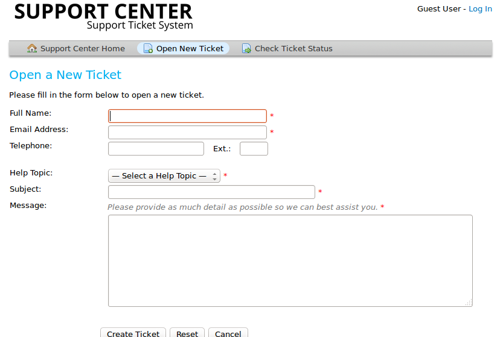

============
Tech Support
============

Helpdesk
========

Helpdesk_ is available to users via the Web using an application called OSTicket_. 

To get help via the Web, browse to `http://chelseapride.org/helpdesk/ <http://chelseapride.org/helpdesk/>`_. When the page loads, you'll have an opportunity to *Open a new ticket* (green button, middle-left side of the page.

To open a new ticket, you must provide your name, Email address, and a brief subject line - just as you would for an Email. For the help topic, you must select *support* from the drop-down menu.

In the message field, please articulate your support needs in as much detail as possible, Explain the problem as well how to reproduce it, what you've tried to solve it, etc.

   
**Important**: Please include the name of your Chelsea School student in the *message* field.

.. _helpdesk: http://chelseapride.org/helpdesk/

.. _Helpdesk: http://chelseapride.org/helpdesk/

.. _OSTicket: http://chelseapride.org/helpdesk/

Tech Mobile
===========

.. index:: helpdesk, tech support, support, troubleshooting, OSticket
